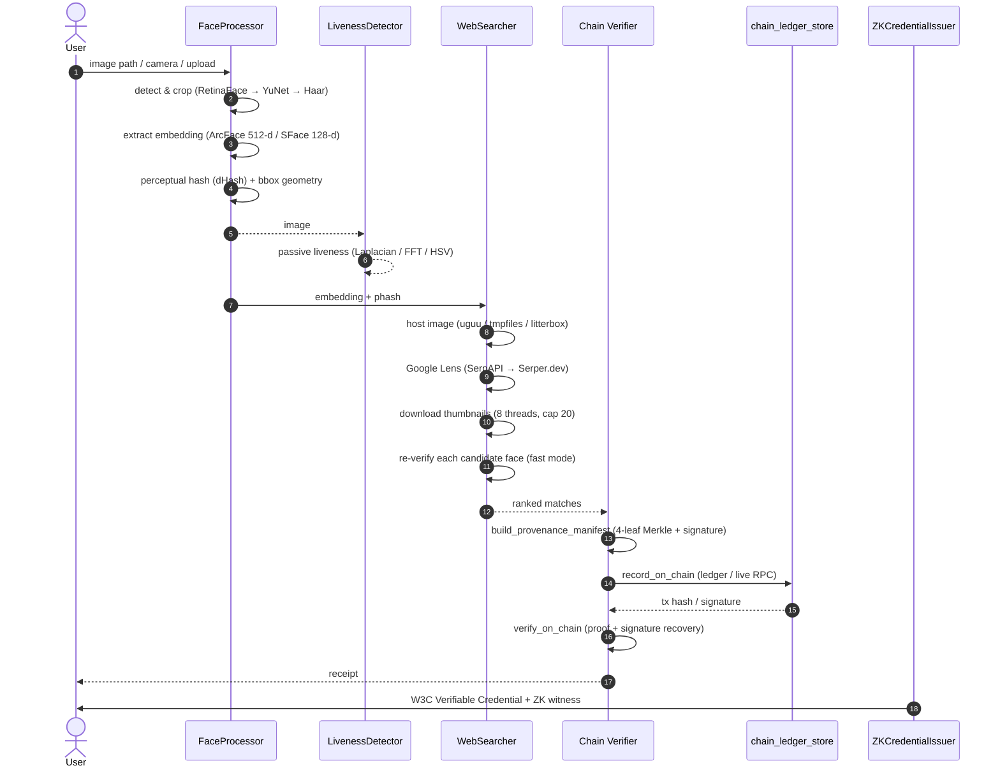
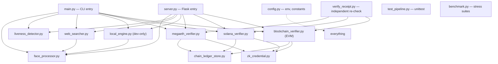

# Lauffey: Architecture

This document describes how Lauffey is built and how the pieces fit together. It is a complement to the README: the README says *what* it does and *how to run it*; this file says *how it works on the inside*.

## Overview

Lauffey is a single 4-stage pipeline: take an image of a face, find a real matching web/social post for that face via a genuine reverse-image search, anchor the finding to a blockchain in a tamper-evident way, and hand back artifacts (a receipt and a W3C Verifiable Credential) that can be re-verified independently later in a completely separate process.

The three "blockchains" (MegaETH-style, Solana-style, EVM) are interchangeable implementations of one interface. By default all three persist to a local JSON ledger rather than a live network; the EVM backend can additionally run against a real RPC. See [What "on-chain" means](#what-on-chain-means).

## Pipeline



## Module map



Two entry points drive the same core: `main.py` (CLI) and `server.py` (Flask web API, served to `frontend/`). Everything else is a library consumed by one or both.

## The verifier contract

All three chain backends implement the same three-method interface. Both entry points and `verify_receipt.py` dispatch on this rather than on chain-specific code.

```python
manifest = verifier.build_provenance_manifest(face_embedding, post_url, post_title, confidence, extra_metadata)
tx_ref   = verifier.record_on_chain(manifest)
result   = verifier.verify_on_chain(tx_ref, manifest)   # {"verified": bool, ...}
```

| | EVM (`blockchain_verifier.py`) | MegaETH (`megaeth_verifier.py`) | Solana (`solana_verifier.py`) |
|---|---|---|---|
| Hash | Keccak-256 | Keccak-256 | SHA-256 |
| Signature | ECDSA secp256k1 (EIP-191), hex `0x…` | ECDSA secp256k1 (EIP-191), hex | Ed25519, Base58 |
| Merkle tree | `MerkleTree` | `MegaETHMerkleTree` | `SolanaMerkleTree` |
| Post claim lives in | `target_post.{url,title}` | `metadata.{post_url,post_title}` | `metadata.{post_url,post_title}` |
| Social leaf key | `leaves.content_leaf` | `leaves.social_leaf` | `leaves.social_leaf` |
| Proof key | `proofs.content_inclusion_proof` | `proofs.social_proof` | `proofs.social_proof` |
| Signed message | Merkle root hex (`encode_defunct`) | `"MegaETH-Attestation:{root}:{ns}"` (stored) | `"Solana-Lauffey-Attestation:{root}:{t}"` (stored) |
| Anchoring artifact | tx calldata / ledger | EigenDA-style blob commitment + ledger | SPL Memo-shaped payload + ledger |

The four leaves are always the same idea: a biometric claim, the social-post claim, a temporal/validator attestation, and the signature. The signature is taken over a **pre-signature 3-leaf root**, then the signature itself becomes the 4th leaf — so tampering with any leaf (or the signature) moves the root.

`verify_receipt.py` rebuilds the correct verifier from the receipt's `blockchain` field before verifying, because the manifest shapes above differ — always using the EVM verifier would silently mis-verify non-EVM receipts.

## What "on-chain" means

Honest labels, per backend:

- **MegaETH and Solana** persist to a local, tamper-evident JSON ledger (`data/ledger_megaeth.json`, `data/ledger_solana.json`) written atomically (tmp file + `os.replace`, see `chain_ledger_store.py`). There is no live RPC. "Recording" appends a record keyed by tx hash / signature; "verifying" re-derives the claims from the manifest and checks them against the persisted record.
- **EVM** defaults `BLOCKCHAIN_RPC` to `"tester"`: an in-process `eth-tester`/py-evm sandbox whose state evaporates between processes, so cross-process re-verification is backed by the same persisted ledger pattern (`data/ledger_evm.json`). With a real `BLOCKCHAIN_RPC` plus `VALIDATOR_PRIVATE_KEY`, it signs and broadcasts a genuine transaction, waits for the receipt, and can surface a block-explorer link (`EXPLORER_TX_URL_TEMPLATES` in `blockchain_verifier.py`).

Why this is still a meaningful proof: the re-verification is performed by an entirely separate process (`verify_receipt.py`), recomputing claims from scratch against persisted state, and the cryptographic layer (Merkle proof, signature, leaf recomputation) is chain-independent.

## Tamper-detection model

`verify_on_chain` never trusts caller-supplied leaf hashes for the content claim. It:

1. **Recomputes the content leaf** from the manifest's own `post_url`/`post_title` claims and compares it to the stored leaf — so mutating the displayed URL fails even if the attacker left `leaves.content_leaf` alone.
2. Re-runs the Merkle inclusion proof against the *recorded root* (from the ledger / calldata), not the manifest's.
3. Recovers the signer (ECDSA `Account.recover_message` / Ed25519 public-key verify) and compares against `validator_address`.

This is exercised in `test_pipeline.py` (per-chain tamper tests), by `main.py --tamper-demo`, by `server.py /api/tamper`, and by Suite 5 of `benchmark.py` (1,000 fuzz attacks).

## Glossary

| Term | Meaning |
|---|---|
| Biometric embedding | Fixed-size float vector encoding a face (512-d ArcFace or 128-d SFace). |
| ArcFace / SFace | Face-recognition models; high vs fast mode respectively. |
| RetinaFace / YuNet | Face *detectors*; high vs fast mode. Haar cascade is the last-resort detector. |
| dHash / perceptual hash | 64-bit difference hash of the cropped face; Hamming distance ≤ 10 marks "same exact image". |
| Liveness / PAD | Passive presentation-attack detection (Laplacian sharpness, FFT moiré over a fixed band, HSV specular dispersion). |
| Provenance manifest | The signed, Merkle-rooted bundle of biometric + social + temporal claims. |
| Merkle root | One hash committing to all leaves. |
| Inclusion proof / audit path | Sibling hashes allowing a single leaf to be re-derived to the root. |
| Receipt | Exported JSON (`receipts/receipt_*.json`) containing tx ref + manifest + timestamp. |
| W3C Verifiable Credential | Signed JSON credential (`credential_*.json`); a ZK witness holds the salt so the embedding can stay private. |
| EigenDA blob commitment | A commitment hash on the MegaETH backend modeling a DA layer. |
| Memo program | Solana SPL Memo-shaped payload format used by the Solana backend. |
| Ledger | `data/ledger_*.json`, the persisted chain of records, atomically appended. |
| Tester RPC | `BLOCKCHAIN_RPC=tester`, an in-process eth-tester sandbox (ephemeral). |
| PRODUCTION_MODE | Env flag on the deployed backend; disables the dev-only local gallery fallback. |
| Image-host chain | uguu.se → tmpfiles.org → litterbox, used to make a public URL for Google Lens. |
| Search cache | `lens_search_<sha256[:16]>.json` per query image, so re-scans don't spend API quota. |

## Conventions

- **Two modes everywhere.** `mode="high"` (RetinaFace + ArcFace 512-d) vs `"fast"` (YuNet + SFace 128-d); components read `BIOMETRIC_ACCURACY_MODE` from `config.py`. Candidate face-verification during search always runs in `fast` mode regardless of the query's mode (see the note in `web_searcher.py`).
- **Degrade, don't crash.** Broad `try/except` blocks silently fall back down a ladder (detector → YuNet → Haar → center crop; embedding → ArcFace → SFace → texture histogram). The texture-histogram fallback is deliberately *not* comparable to real embeddings and is rejected during candidate verification.
- **JSON state, atomic writes.** Ledgers, profile metadata, and embedding caches all live in `data/`, written via tmp-file + `os.replace`.
- **Secrets are gitignored.** Validator keys (`data/*_validator_key.json`), `.env`, and live ledgers never get committed.
- **No third-party env loading.** `config.load_env()` parses `.env` by hand.
- **Testing** is `unittest` in `test_pipeline.py`; `benchmark.py` is the stress/perf harness. No external test framework is used.